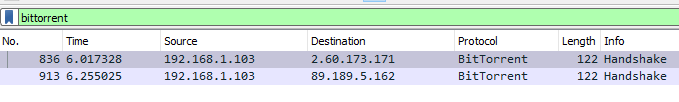
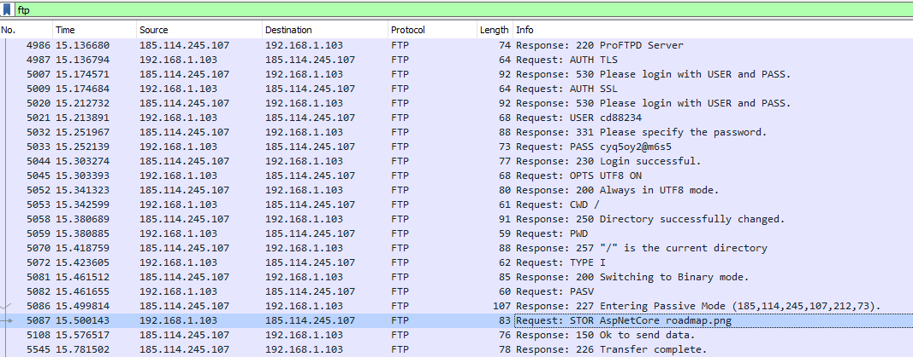
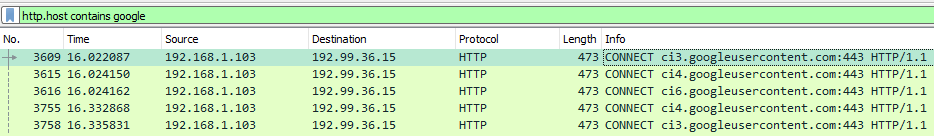
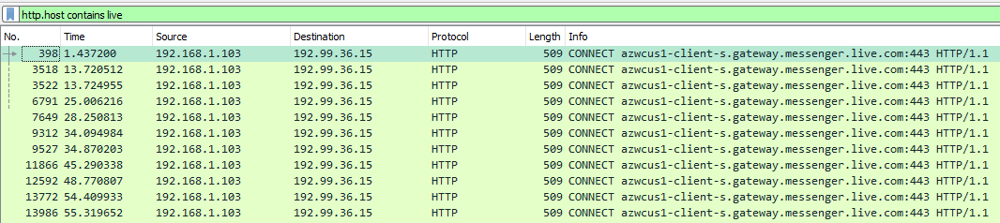
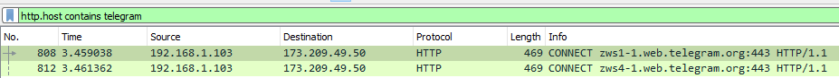
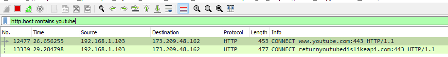
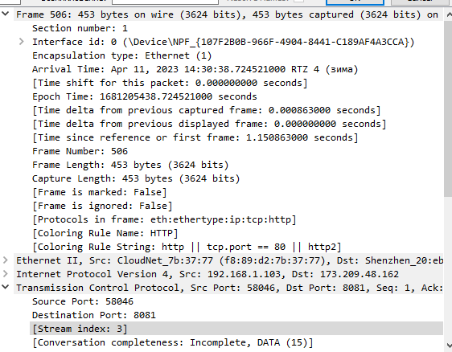

# Домашняя работа по дисциплине "Интеллектуальные сети" 
#### Гусев Михаил Александрович. ЭВТ-19-1б
## Техническое заданеие:
1. Прочитать [статью](https://cyberleninka.ru/article/n/analiz-zashifrovannogo-setevogo-trafika-na-osnove-vychisleniya-entropii-i-primeneniya-neyrosetevyh-klassifikatorov)
2. В любом пакете захвата сетевых пакетов (wireshark) выполнить захват указанных в статье данных.
3. Определить параметры, указанные в статье (3 на выбор).
4. Составить отчет.

## Выполнение:
1. Захват пакетов BitTorrent

2. Захват пакетов FTP

3. Захват пакетов Gmail

4. Захват пакетов Skype

5. Захват пакетов Telegram Web

6. Захват пакетов YouTube

7. Все параметры пакетов могут быть извлечены из специального блока метаданных, который содержит информацию о размере потока в байтах, времени отправления первого и предыдущего фрейма в TCP-потоке и т.д.

**Вывод:** По результатам проведенной работы был составлен отчет, в котором были описаны процедуры захвата данных и определения параметров, а также были определены параметры, которые описанные в статье.